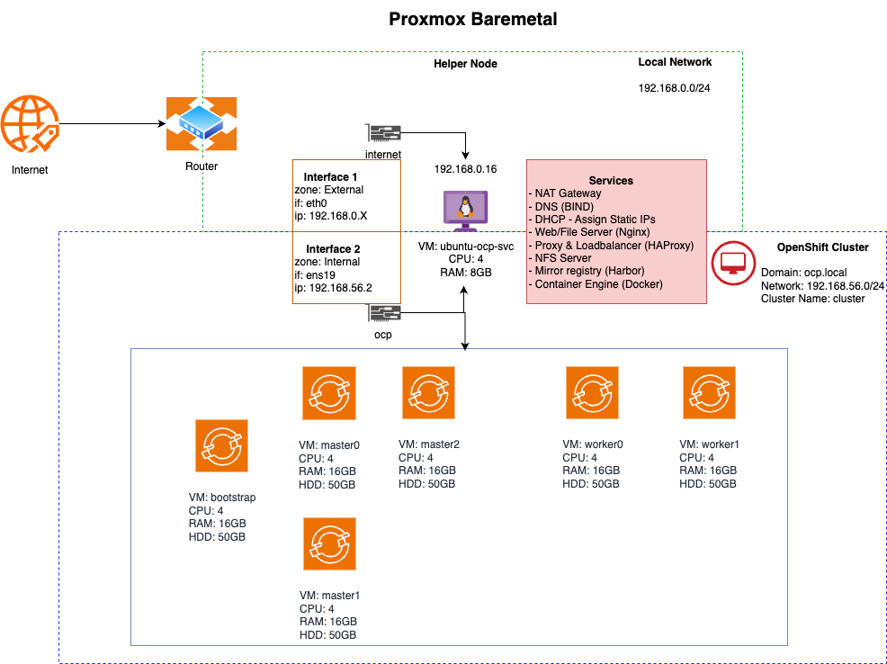

# OpenShift 4 Bare Metal Install - Disconected User Provisioned Infrastructure (UPI)

<!-- - [OpenShift 4 Bare Metal Install - User Provisioned Infrastructure (UPI)](#openshift-4-bare-metal-install---user-provisioned-infrastructure-upi) -->

#### Quick links
   1. [Architecture Diagram](#architecture-diagram)
   1. [Prepare the 'Bare Metal' environment](#prepare-the-bare-metal-vms)
   1. [Configure Environmental Services](#configure-ocp-svc-vm-for-openshift-environment)
   1. [Initialize openshift installation](#initialize-openshift-installation)
   1. [Boot Up the CoreOS VMs](#boot-up-the-coreos-vms)
   1. [Monitor the Bootstrap Process](#monitor-the-bootstrap-process)
   1. [Remove the Bootstrap Node](#remove-the-bootstrap-node)
   1. [Wait for installation to complete](#wait-for-installation-to-complete)
   1. [Join Worker Nodes](#join-worker-nodes)
   1. [Post Installation of the Cluster](#post-installation-of-the-cluster)
   1. [Create the first Admin user](#create-the-first-admin-user)
   1. [Access the OpenShift Console](#access-the-openshift-console)
   1. [Troubleshooting](#troubleshooting)

## Architecture Diagram



## Prepare the 'Bare Metal' VMs

> **Proxmox 8.4+ used in this guide**
**We will be using terraform to provision all the VMs**
Terraform provider Link - https://registry.terraform.io/providers/Telmate/proxmox/latest

> **Reference for infrastructure requirements**
[https://docs.redhat.com/en/documentation/openshift_container_platform/4.19/html/installing_on_bare_metal/preparing-to-install-on-bare-metal](https://docs.redhat.com/en/documentation/openshift_container_platform/4.19/html/installing_on_bare_metal/preparing-to-install-on-bare-metal)


1. **[Download ubuntu 24.04 LTS ISO](https://mirror.ajl.albony.in/ubuntu-releases/24.04.3/ubuntu-24.04.3-live-server-amd64.iso)**
1. **[Download Redhat CoreOS ISO](https://mirror.openshift.com/pub/openshift-v4/x86_64/dependencies/rhcos/latest/rhcos-4.19.0-x86_64-live-iso.x86_64.iso)**
1. **`Create a new network bridge called 'ocp' under Networking`**
1. **`Create a services virtual machine with minimum settings:`**
   - **Name:** `ocp-svc`
   - **No of cpu:** `4`
   - **Memory:** `16GB`
   - **Storage:** `200GB HDD`
   - **Network1:** NIC1 connected to the **`internet`** network **`(192.168.0.0/24)`**
   - **Network2:** NIC2 connected to the **`ocp`** network **`(192.168.56.0/24)`**
   - Load the **`ubuntu-24.04.3-live-server-amd64.iso`** image into the CD/DVD drive
1. **`Create 3 Control Plane virtual machines with minimum settings:`**
   - **Name**: `master# (Example: master0)`
   - **No of cpu:** `4`
   - **Memory:** `16GB`
   - **Storage:** `50GB HDD`
   - **Network:** NIC connected to the **`ocp`** network **`(192.168.56.0/24)`**
   - Load the **`rhcos-4.19.0-x86_64-live-iso.x86_64.iso`** image into the CD/DVD drive
1. **`Create 2 Worker virtual machines (or more if you want) with minimum settings:`**
   - **Name:** `worker# (Example worker0)`
   - **No of cpu:** `4`
   - **Memory:** `16GB`
   - **Storage:** `200GB HDD`
   - **Network:** NIC connected to the **`ocp`** network **`(192.168.56.0/24)`**
   - Load the **`rhcos-4.19.0-x86_64-live-iso.x86_64.iso`** image into the CD/DVD drive
1. **`Create a Bootstrap virtual machine (this vm will be deleted once installation completes) with minimum settings:`**
   - **Name:** `boostrap`
   - **No of cpu:** `4`
   - **Memory:** `16GB`
   - **Storage:** `50GB HDD`
   - **Network:** NIC connected to the **`ocp`** network **`(192.168.56.0/24)`**
   - Load the `rhcos-4.19.0-x86_64-live-iso.x86_64.iso` image into the CD/DVD drive

## Configure ocp-svc VM for openshift environment

1. **SSH to the ocp-svc VM**
   ```bash
   ssh root@{ocp-svc_IP_address}
   ```

1. **Become root user**
   ```bash
   sudo su -
   ```

1. **Update and upgrade ubuntu packages**
   ```bash
   apt-get update
   apt-get upgrade -y
   ```

1. **Install some required ubuntu packages**
   ```bash
   apt-get install -y build-essential rsyslog net-tools netcat-openbsd zip unzip
   apt-get install -y nano ca-certificates git acl iputils-ping
   apt-get install -y python3-pip python3-full cron jq libgpgme11 vim
   ```

1. **Change timezone to Asia/Kolkata**
   ```bash
   timedatectl set-timezone Asia/Kolkata
   timedatectl set-ntp true
   ```

1. **Create cronjob file**
   ```bash
   cat > /var/spool/cron/crontabs/root << EOF
   # To define the time you can provide concrete values for
   # minute (m), hour (h), day of month (dom), month (mon),
   # and day of week (dow) or use '*' in these fields (for 'any').
   # 
   # For example, you can run a backup of all your user accounts
   # at 5 a.m every week with:
   # 0 5 * * 1 tar -zcf /var/backups/home.tgz /home/
   # 
   # For more information see the manual pages of crontab(5) and cron(8)
   # 
   # m h  dom mon dow   command

   @reboot sleep 60s && docker start `docker ps -aq -f "status=exited"`
   EOF
   ```

1. **Create the required directories with the specified permissions:**

   ```bash
   mkdir -p /ocp/{data,installer,ocp-setup,rchos}
   mkdir -p /ocp/data/ssl
   mkdir -p /ocp/registry/{quayroot,quaystorage,sqlitestorage,harbor}

   chmod 777 /ocp/data
   chmod 755 /ocp/data/ssl /ocp/registry/quayroot /ocp/registry/quaystorage \
      /ocp/registry/sqlitestorage /ocp/installer /ocp/ocp-setup /ocp/registry/harbor

   chmod 750 /ocp/rchos
   ```

1. **Download Softwares**

   <!-- 1. Download Ubuntu cloud image [Ubuntu 24.04 minimal cloudimg amd64](https://cloud-images.ubuntu.com/minimal/releases/noble/release/ubuntu-24.04-minimal-cloudimg-amd64.img) -->
   1. Login to [RedHat OpenShift Cluster Manager](https://cloud.redhat.com/openshift)
   1. Go to Dashboard
   1. Select 'Create Cluster' from the 'Clusters' navigation menu
   1. Select Datacenter
   1. Select 'Bare Metal (x86_64)'
   1. Select 'Full Control'
   1. Download the following files:

      - [Openshift Installer for Linux](#)
         ```bash
         wget -P /ocp/installer https://mirror.openshift.com/pub/openshift-v4/multi/clients/ocp/4.19.4/amd64/openshift-install-linux.tar.gz
         tar -xzf /ocp/installer/openshift-install-linux.tar.gz -C /usr/local/bin
         ```
      - [Openshift Client Linux](#)
         ```bash
         wget -P /ocp/installer https://mirror.openshift.com/pub/openshift-v4/x86_64/clients/ocp/4.19.4/openshift-client-linux.tar.gz
         tar -xzf /ocp/installer/openshift-client-linux.tar.gz -C /usr/local/bin
         ```
      - [Mirror Registry amd64](#)
         ```bash
         wget -P /ocp/installer https://mirror.openshift.com/pub/cgw/mirror-registry/latest/mirror-registry-amd64.tar.gz
         tar -xzf /ocp/installer/mirror-registry-amd64.tar.gz -C /usr/local/bin
         ```
      - [oc Mirror rhel9](#)
         ```bash
         wget -P /ocp/installer https://mirror.openshift.com/pub/openshift-v4/x86_64/clients/ocp/4.19.4/oc-mirror.rhel9.tar.gz
         tar -xzf /ocp/installer/oc-mirror.rhel9.tar.gz -C /usr/local/bin
         ```
      - [opm Linux](#)
         ```bash
         wget -P /ocp/installer https://mirror.openshift.com/pub/openshift-v4/clients/ocp/4.19.4/opm-linux.tar.gz
         tar -xzf /ocp/installer/opm-linux.tar.gz -C /usr/local/bin
         ```
      - Pull secret (Need to download from the dashboard or using [automation](#))
      - [Red Hat Enterprise Linux CoreOS (RHCOS)](#)
         ```bash
         wget -P /ocp/rchos https://mirror.openshift.com/pub/openshift-v4/x86_64/dependencies/rhcos/latest/rhcos-4.19.0-x86_64-live-iso.x86_64.iso
         ```

1. **Confirm Client Tools are working**

   ```bash
   oc version
   ```

1. **Update the preferred editor**

   ```bash
   export OC_EDITOR="nano"
   export KUBE_EDITOR="nano"
   ```

1. **Clone the git repository**
   ```bash
   cd /root

   git clone https://github.com/sdnath05/ocp-setup-auto.git ocp-setup

   cp -r ./ocp-setup/python-scripts /ocp/installer/
   ```

1. **Copy the ocm executable**
   ```bash
   cd /root
   cp ./ocp-setup/ansible-playbook/roles/ocp-initialize/files/ocm_linux_amd64.zip /ocp/installer/

   unzip ./ocp-setup/ansible-playbook/roles/ocp-initialize/files/ocm_linux_amd64.zip -d /usr/local/bin
   ```

1. **Create the .env file**

   Get offline token from [here](https://console.redhat.com/openshift/token)
   ```bash
   export OFFLINE_ACCESS_TOKEN="<provide your offline token>"

   cat > /ocp/installer/python-scripts/.env << EOF
   SSO_URL=""
   OFFLINE_ACCESS_TOKEN="${OFFLINE_ACCESS_TOKEN}"
   EXECUTABLE_PATH="/usr/local/bin"
   OUT_DIR="/ocp"
   PULL_SECRET_URL="https://api.openshift.com/api/accounts_mgmt/v1/access_token"
   EOF

   cd /ocp/installer/python-scripts
   python3 -m pip config set global.break-system-packages true
   pip3 install -r requirements.txt
   ```

1. **Configure Network**

   1. **Install Packages**
      ```bash
      apt-get install -y network-manager firewalld
      ```

   1. **Copy Network files**
      ```bash
      cd /root

      cp ./ocp-setup/ansible-playbook/roles/ocp-configure-network/files/00-installer-config.yaml /etc/netplan/
      cp ./ocp-setup/ansible-playbook/roles/ocp-configure-network/files/50-cloud-init.yaml /etc/netplan/
      cp ./ocp-setup/ansible-playbook/roles/ocp-configure-network/files/90-NM-626dd384-8b3d-3690-9511-192b2c79b3fd.yaml /etc/netplan/
      cp ./ocp-setup/ansible-playbook/roles/ocp-configure-network/files/90-NM-cb177419-4682-353f-b54c-7d4f2bd80f64.yaml /etc/netplan/
      cp ./ocp-setup/ansible-playbook/roles/ocp-configure-network/files/NetworkManager.conf /etc/NetworkManager/
      ```

   1. **Create and backup the files**
      ```bash
      [ -d /var/run/network ] || mkdir -p /var/run/network
      [ -f /var/run/network/ifstate ] || touch /var/run/network/ifstate

      [ -f /usr/lib/NetworkManager/conf.d/10-globally-managed-devices.conf ] && \
      cp /usr/lib/NetworkManager/conf.d/10-globally-managed-devices.conf /usr/lib/NetworkManager/conf.d/10-globally-managed-devices.conf.bak && \
      rm /usr/lib/NetworkManager/conf.d/10-globally-managed-devices.conf

      [ -f /etc/NetworkManager/NetworkManager.conf ] && \
      cp /etc/NetworkManager/NetworkManager.conf /etc/NetworkManager/NetworkManager.conf.bak

      sed -i -e "s/<change-me>/$(date +%s)/g" /etc/netplan/90-NM-626dd384-8b3d-3690-9511-192b2c79b3fd.yaml
      ```

   1. **Apply changes and restart the network**
      ```bash
      netplan apply
      sleep 2s
      systemctl restart NetworkManager
      systemctl status NetworkManager
      ```

   1. **Configure internal and external zone and set masquerade**
      ```bash
      export ocp_ethernet="ens19"
      export internet_ethernet="eth0"

      nmcli connection modify netplan-${ocp_ethernet} connection.zone internal
      nmcli connection modify netplan-${internet_ethernet} connection.zone external
      systemctl restart NetworkManager

      systemctl disable systemd-networkd-wait-online.service

      echo -n "Adding the masquerade for both external and internal zones"
      firewall-cmd --zone=external --add-masquerade --permanent
      firewall-cmd --zone=internal --add-masquerade --permanent
      firewall-cmd --reload
      ```

   1. **Check the active zones**
      ```bash
      echo "Checking the active zones"
      firewall-cmd --get-active-zones

      # Check the current settings of each zone
      firewall-cmd --list-all --zone=internal
      firewall-cmd --list-all --zone=external
      ```

1. **Configure SQUID(Internet PROXY) (optional)**
   1. **Install Packages**
      ```bash
      apt-get install -y squid
      ```

   1. **Configure squid**
      ```bash
      cat > /etc/squid/conf.d/debian.conf << EOF
      #
      # Squid configuration settings for Debian
      #

      # Logs are managed by logrotate on Debian
      logfile_rotate 0

      # For extra security Debian packages only allow
      # localhost to use the proxy on new installs
      #
      #http_access allow localnet
      acl ocp_subnet src 192.168.56.0/24

      http_access allow localhost
      http_access allow ocp_subnet
      EOF
      ```

   1. **Apply changes and start the squid**
      ```bash
      firewall-cmd --add-service=squid --zone=external --permanent
      firewall-cmd --add-service=squid --zone=internal --permanent
      firewall-cmd --add-port=3128/tcp --zone=external --permanent
      firewall-cmd --add-port=3128/tcp --zone=internal --permanent
      firewall-cmd --reload

      systemctl enable squid
      systemctl start squid
      systemctl status squid
      ```
1. **Configure DNS**
   1. **Installing Packages**
      ```bash
      apt-get install -y bind9 bind9utils bind9-utils bind9-doc dnsutils
      ```
   
   1. **Copy DNS files**
      ```bash
      cd /root

      cp ./ocp-setup/ansible-playbook/roles/ocp-configure-dns/files/named.conf /etc/bind/
      cp ./ocp-setup/ansible-playbook/roles/ocp-configure-dns/files/named.conf.options /etc/bind/
      cp ./ocp-setup/ansible-playbook/roles/ocp-configure-dns/files/named.conf.local /etc/bind/
      cp -r ./ocp-setup/ansible-playbook/roles/ocp-configure-dns/files/zones/ /etc/bind/
      ```

   1. **Apply changes and start DNS server**
      ```bash
      chmod 755 /etc/bind/zones
      # We will allow 53 (DNS port) for internal and external firewall
      # for OCP 4.9 and later 53/tcp is required
      firewall-cmd --add-port=53/udp --zone=internal --permanent
      firewall-cmd --add-port=53/tcp --zone=external --permanent
      firewall-cmd --reload

      systemctl enable named
      systemctl start named
      systemctl status named
      ```

   1. **Verify DNS service**
      ```bash
      systemctl restart named

      # Confirm dig now sees the correct DNS results by using the DNS Server running locally
      dig ocp.local
      # The following should return the answer bootstrap.cluster.ocp.local from the local server
      dig -x 192.168.56.100
      ```

1. **Configure DHCP**
   1. **Install Packages**
      ```bash
      apt-get install -y isc-dhcp-server
      ```
   
   1. **Copy dhcpd.conf file**
      ```bash
      cp ./ocp-setup/ansible-playbook/roles/ocp-configure-dhcp/files/dhcpd.conf /etc/dhcp/
      ```

   1. **Apply changes and restart the dhcp server**
      ```bash
      # allowing dhcp service to firewall
      firewall-cmd --add-service=dhcp --zone=internal --permanent
      firewall-cmd --reload

      systemctl enable isc-dhcp-server
      systemctl restart isc-dhcp-server
      systemctl status isc-dhcp-server
      ```

1. **Configure NGINX**
   1. **Add nginx ppa**
      ```bash
      add-apt-repository ppa:ondrej/nginx
      ```

   1. **Install Packages**
      ```bash
      apt-get update
      apt-get install -y nginx
      ```

   1. **Copy nginx config file**
      ```bash
      cd /root

      cp ./ocp-setup/ansible-playbook/roles/ocp-configure-nginx/files/nginx.conf /etc/nginx/sites-available/default
      ```

   1. **Apply changes and fixing file permisions**
      ```bash
      filepath="/ocp/ocp-setup"
      chown -R $USER:www-data $filepath

      # 750 permision to folder and 640 to files
      find $filepath -type d -exec chmod u=rwx,g=rx,o= '{}' \;
      find $filepath -type f -exec chmod u=rw,g=r,o= '{}' \;

      filepath2="/ocp/rchos"
      chown -R $USER:www-data $filepath2

      # 750 permision to folder and 640 to files
      find $filepath2 -type d -exec chmod u=rwx,g=rx,o= '{}' \;
      find $filepath2 -type f -exec chmod u=rw,g=r,o= '{}' \;

      # These files folders are not required for now
      # find ./*/files -type d -exec chmod ug=rwx,o= '{}' \;
      # find ./*/files -type f -exec chmod ug=rw,o= '{}' \;

      firewall-cmd --add-port=8083/tcp --zone=internal --permanent
      firewall-cmd --add-port=8083/tcp --zone=external --permanent
      firewall-cmd --reload
      ```

   1. **Start the nginx**
      ```bash
      systemctl enable nginx
      systemctl start nginx    
      systemctl status nginx
      systemctl reload nginx  
      ```

1. **Configure HAPROXY**
   1. **Install Packages**
      ```bash
      apt-get install -y haproxy
      ```

   1. **Copy haproxy configuration file**
      ```bash

      cp ./ocp-setup/ansible-playbook/roles/ocp-configure-haproxy/files/haproxy.cfg /etc/haproxy/
      ```

   1. **Apply changes for haproxy**
      ```bash
      firewall-cmd --add-port=3130/tcp --zone=internal --permanent # proxy hosted on helper node
      firewall-cmd --add-service=http --zone=internal --permanent # web services hosted on worker nodes
      firewall-cmd --add-service=http --zone=external --permanent # web services hosted on worker nodes
      firewall-cmd --add-service=https --zone=internal --permanent # web services hosted on worker nodes
      firewall-cmd --add-service=https --zone=external --permanent # web services hosted on worker nodes
      firewall-cmd --add-port=6443/tcp --zone=internal --permanent # kube-api-server on control plane nodes
      firewall-cmd --add-port=6443/tcp --zone=external --permanent # kube-api-server on control plane nodes
      firewall-cmd --add-port=22623/tcp --zone=internal --permanent # machine-config server
      firewall-cmd --add-port=9000/tcp --zone=external --permanent # HAProxy Stats
      firewall-cmd --reload
      ```

   1. **Start the haproxy server**
      ```bash
      systemctl enable haproxy
      systemctl start haproxy
      systemctl restart haproxy
      systemctl status haproxy
      ```
   
   1. **Check openshift nodes stats**
      > The IP might be different for you

      **[http://192.168.0.16:9000/stats](http://192.168.0.16:9000/stats)**

1. **Configure NFS (optional)**
   1. **Install Packages**
      ```bash
      apt-get install -y nfs-kernel-server
      ```

   1. **Apply changes**
      ```bash
      cat >> /etc/exports << EOF

      /ocp/data   192.168.56.0/24(rw,sync,no_subtree_check)
      EOF

      firewall-cmd --add-service=nfs --zone=internal --permanent
      firewall-cmd --add-service=rpc-bind --zone=internal --permanent
      firewall-cmd --reload
      ```

   1. **Restart the NFS service**
      ```bash
      exportfs -ra
      systemctl restart nfs-kernel-server
      ```

1. **Configure Mirror Registry (Docker and Harbor)**
   1. **Uninstall Packages**
      ```bash
      for pkg in docker.io docker-doc docker-compose docker-compose-v2 podman-docker containerd runc; do apt-get remove --purge $pkg; done
      ```

   1. **Download docker.asc**
      ```bash
      curl -fsSL https://download.docker.com/linux/ubuntu/gpg -o /etc/apt/keyrings/docker.asc
      
      chmod a+r /etc/apt/keyrings/docker.asc

      # Add the repository to Apt sources:
      echo \
      "deb [arch=$(dpkg --print-architecture) signed-by=/etc/apt/keyrings/docker.asc] https://download.docker.com/linux/ubuntu \
      $(. /etc/os-release && echo "${UBUNTU_CODENAME:-$VERSION_CODENAME}") stable" | \
      tee /etc/apt/sources.list.d/docker.list > /dev/null

      apt-get update
      ```

   1. **Install Docker Packages**
      ```bash
      apt-get install docker-ce docker-ce-cli containerd.io docker-buildx-plugin docker-compose-plugin
      ```

   1. **Download harbor cli and install**
      ```bash
      wget https://github.com/goharbor/harbor-cli/releases/download/v0.0.8/harbor-cli_0.0.8_linux_amd64.deb -P /ocp/installer/

      cd /ocp/installer
      apt-get install ./harbor-cli_0.0.8_linux_amd64.deb
      ```

   1. **Creating the ssl files**
      ```bash
      openssl req -x509 \
         -sha256 -days 3650 \
         -nodes \
         -newkey rsa:2048 \
         -subj "/C=IN/ST=West Bengal/L=Kolkata/O=XYZ Ltd./OU=Developement/CN=ocp.local/emailAddress=admin@subratadebnath.in" \
         -addext "subjectAltName=DNS:*.ocp.local,DNS:cluster.ocp.local,DNS:*.cluster.ocp.local,DNS:apps.cluster.ocp.local,DNS:*.apps.cluster.ocp.local" \
         -keyout /ocp/data/ssl/ocp.key -out /ocp/data/ssl/ocp.crt

      openssl req -x509 \
         -sha256 -days 3650 \
         -nodes \
         -newkey rsa:2048 \
         -subj "/C=IN/ST=West Bengal/L=Kolkata/O=XYZ Ltd./OU=Developement/CN=*.ocp.local/emailAddress=admin@subratadebnath.in" \
         -addext "subjectAltName=DNS:*.ocp.local,DNS:cluster.ocp.local,DNS:*.cluster.ocp.local,DNS:apps.cluster.ocp.local,DNS:*.apps.cluster.ocp.local" \
         -keyout /ocp/data/ssl/ocp-registry.key -out /ocp/data/ssl/ocp-registry.crt
      ```
   
   1. **Verify the certificates**
      ```bash
      # For verify the crt file
      openssl x509 -in /ocp/data/ssl/ocp.crt -text -noout
      # For verify the key file
      openssl rsa -in /ocp/data/ssl/ocp.key -check
      ```
   
   1. **Copy the certificate file and apply**
      ```bash
      export quay_host_port="7443"

      firewall-cmd --add-port=${quay_host_port}/tcp --zone=internal --permanent # kube-api-server on control plane nodes
      firewall-cmd --add-port=${quay_host_port}/tcp --zone=external --permanent # kube-api-server on control plane nodes
      firewall-cmd --reload
      
      cp /ocp/data/ssl/ocp-registry.crt /usr/local/share/ca-certificates
      cp /ocp/data/ssl/ocp.crt /usr/local/share/ca-certificates
      update-ca-certificates

      awk -v cmd='openssl x509 -noout -subject' '/BEGIN/{close(cmd)};{print | cmd}' < /etc/ssl/certs/ca-certificates.crt
      ```

   1. **Get the harbor installer file**
      ```bash
      wget -P /ocp/installer/ https://github.com/goharbor/harbor/releases/download/v2.13.2/harbor-offline-installer-v2.13.2.tgz

      mkdir -p /ocp/installer/harbor

      tar -xzf /ocp/installer/harbor-offline-installer-v2.13.2.tgz -C /ocp/installer
      ```

   1. **Copy harbor.yaml file**
      ```bash
      cp ./ocp-setup/ansible-playbook/roles/ocp-configure-docker-harbor/files/harbor.yaml /ocp/installer/harbor/harbor.yml
      ```

   1. **Create certificate directory for docker**
      ```bash
      export quay_host_name="registry.ocp.local"
      export quay_host_port="7443"

      mkdir -p /etc/docker/certs.d/${quay_host_name}:${quay_host_port}
      cp /ocp/data/ssl/ocp-registry.crt /etc/docker/certs.d/${quay_host_name}:${quay_host_port}/ocp-registry.cert
      cp /ocp/data/ssl/ocp-registry.key /etc/docker/certs.d/${quay_host_name}:${quay_host_port}
      cp /ocp/data/ssl/ocp-registry.crt /etc/docker/certs.d/${quay_host_name}:${quay_host_port}/ca.crt
      systemctl restart docker
      systemctl status docker
      ```

   1. **Create the Mirror Registry**
      ```bash
      cd /ocp/installer/harbor
      bash ./install.sh
      ```

   1. **Generate the pull-secret.json**
      ```bash
      cd /ocp/installer/python-scripts

      python3 main.py
      ```

   1. **Update pull-secret.json with registry username and password**
      ```bash
      export registry_user="admin"
      export registry_pass="RandomKey135"

      cd /ocp/installer/python-scripts

      python3 updatePullSecret.py -u ${registry_user} -p ${registry_pass} -d /ocp
      ```

   1. **Sign in into registry using docker registry.ocp.local:7443**
      ```bash
      mkdir -p /root/.docker

      cat /ocp/pull-secret.json | jq > /root/.docker/config.json

      docker login \
         -u ${registry_user} \
         -p ${registry_pass} \
         ${quay_host_name}:${quay_host_port}
      ```

   1. **Sign in into harbor using harbor-cli**
      ```bash
      harbor-cli login ${quay_host_name}:${quay_host_port} -u ${registry_user} -p ${registry_pass}
      ```
   
   1. **Creating "ocp4" namespace in harbor**
      ```bash
      harbor-cli project create ocp4 --public=false --storage-limit=-1
      ```

   1. **Check the harbor registry**
      user: admin
      password: RandomKey135

      Link: [https://registry.ocp.local:7443/](https://registry.ocp.local:7443/)

## Clone the openshift 4.19.4 images and catalogs

1. **Clone using imageset-config file**
   ```bash
   # Pull images to local
   oc-mirror -c /ocp/installer/python-scripts/manifests/imageset-config.yaml file:///ocp/data/mirror/images --v2 --cache-dir /ocp/data/mirror/

   # local to registry
   oc-mirror -c /ocp/installer/python-scripts/manifests/imageset-config.yaml --from file:///ocp/data/mirror/images docker://registry.ocp.local:7443/ocp4 --v2 --cache-dir /ocp/data/mirror/
   ```
1. **Get list of any operators under any catalog use this from below**
   ```bash
   opm-linux render registry.redhat.io/redhat/certified-operator-index:v4.19 | jq -s '.[] | select(.schema=="olm.package") | .name' | sort | uniq
   ```

## Initialize openshift installation

1. **Generate an SSH key pair keeping all default options**

   ```bash
   export ssh_file_path="/root/.ssh/id_rsa"

   echo -n "y" | ssh-keygen -q -b 4096 -t rsa -C "ocp-svc" -f ${ssh_file_path} -N ""
   ```

1. **Clean the /ocp/ocp-setup**
   ```bash
   rm -rf /ocp/ocp-setup
   mkdir /ocp/ocp-setup
   chmod 750 /ocp/ocp-setup
   chown root:www-data /ocp/ocp-setup
   ```

1. **Update pull-secret.json**
   ```bash
   cd /ocp/installer/python-scripts

   python3 updatePullSecretPrivate.py -u ${registry_user} -p ${registry_pass} -d /ocp
   ```

1. **Generate install-config.yaml**

   ```bash
   export installer_dir="/ocp/ocp-setup"
   export script_dir="/ocp/installer/python-scripts"
   export manifest_dir="/ocp/ocp-setup/manifests"
   export cert_file="/ocp/data/ssl/ocp-registry.crt"

   cd $script_dir

   python3 updateYaml.py --public-key /root/.ssh/id_rsa.pub --pull-secret /ocp/pull-secret-private.json --installer-dir /ocp/ocp-setup --cert-file ${cert_file}

   sed -i 's/additionalTrustBundle: |-/additionalTrustBundle: |/g' ${installer_dir}/install-config.yaml
   ```

1. **Generate configuration files for the openshift installation**
   ```bash
   cp ${installer_dir}/install-config.yaml /ocp/install-config.yaml.bak

   openshift-install create manifests --dir ${installer_dir}

   python3 ${script_dir}/updateSchedularYaml.py --schedular-file ${manifest_dir}/cluster-scheduler-02-config.yml

   openshift-install create ignition-configs --dir ${installer_dir}

   export filepath="/ocp/ocp-setup"
   chown -R $USER:www-data $filepath

   # 750 permision to folder and 640 to files
   find $filepath -type d -exec chmod u=rwx,g=rx,o= '{}' \;
   find $filepath -type f -exec chmod u=rw,g=r,o= '{}' \;
   ```

1. **Fix file permissions for the rchos directory**

   ```bash
   export filepath="/ocp/rchos"
   chown -R $USER:www-data $filepath

   # 750 permision to folder and 640 to files
   find $filepath -type d -exec chmod u=rwx,g=rx,o= '{}' \;
   find $filepath -type f -exec chmod u=rw,g=r,o= '{}' \;
   ```

1. **Check for openshift configuration files**
   > The IP might be different for you

   **[http://192.168.0.16:8083/ocp-setup/](http://192.168.0.16:8083/ocp-setup/)**

1. **Check for coreos related files**
   > The IP might be different for you

   **[http://192.168.0.16:8083/rchos/](http://192.168.0.16:8083/rchos/)**

## Boot Up the CoreOS VMs

1. **Power on the bootstrap VM (select 'Tab' to enter boot configuration for kernel). Enter the following configuration:**

   ```bash
   # Bootstrap Node - bootstrap
   sudo coreos-installer install /dev/sda --ignition-url=http://192.168.56.2:8083/ocp-setup/bootstrap.ign --insecure-ignition --insecure

   # Or if you want to use the kernel mode
   coreos.inst.install_dev=/dev/sda coreos.inst.image_url=http://192.168.56.2:8083/rhcos coreos.inst.insecure=yes coreos.inst.ignition_url=http://192.168.56.2:8083/ocp-setup/bootstrap.ign
   ```

1. **Power on master/control-plane\# VMs (select 'Tab' to enter boot configuration for kernel mode). Enter the following commands:**

   ```bash
   # Each of the Control Plane Nodes - control-plane<n>
   sudo coreos-installer install /dev/sda --ignition-url=http://192.168.56.2:8083/ocp-setup/master.ign --insecure-ignition --insecure
   
   # Or if you want to use the kernel mode
   coreos.inst.install_dev=sda coreos.inst.image_url=http://192.168.56.2:8083/rhcos coreos.inst.insecure=yes coreos.inst.ignition_url=http://192.168.56.2:8083/ocp-setup/master.ign
   
   ```

1. **Power on the worker/compute\# VMs (select 'Tab' to enter boot configuration for kernel mode). Enter the following commands:**

   ```bash
   # Each of the Worker Nodes - compute<n>
   sudo coreos-installer install /dev/sda -I http://192.168.56.2:8083/ocp-setup/worker.ign --insecure-ignition --insecure

   # Or if you want to use the kernel mode
   coreos.inst.install_dev=sda coreos.inst.image_url=http://192.168.56.2:8083/rhcos coreos.inst.insecure=yes coreos.inst.ignition_url=http://192.168.56.2:8083/ocp-setup/worker.ign
   ```

## Monitor the Bootstrap Process

1. You can monitor the bootstrap process from the ocp-svc host at different log levels (debug, error, info)

   ```bash
   openshift-install --dir /ocp/ocp-setup wait-for bootstrap-complete --log-level=debug
   ```

1. Once bootstrapping is complete the ocp-boostrap node [can be removed](#remove-the-bootstrap-node)

## Remove the Bootstrap Node

1. Remove all references to the `bootstrap` host from the `/etc/haproxy/haproxy.cfg` file

   ```bash
   # Two entries
   vim /etc/haproxy/haproxy.cfg
   # Restart HAProxy - If you are still watching HAProxy stats console you will see that the ocp-boostrap host has been removed from the backends.
   systemctl reload haproxy
   ```

1. The bootstrap host can now be safely shutdown and deleted from the Proxmox Console, the host is no longer required

## Wait for installation to complete

> IMPORTANT: if you set mastersSchedulable to false the [worker nodes will need to be joined to the cluster](#join-worker-nodes) to complete the installation. This is because the OpenShift Router will need to be scheduled on the worker nodes and it is a dependency for cluster operators such as ingress, console and authentication.

1. Collect the OpenShift Console address and kubeadmin credentials from the output of the install-complete event

   ```bash
   openshift-install --dir /ocp/ocp-setup wait-for install-complete
   ```

1. Continue to join the worker nodes to the cluster in a new tab whilst waiting for the above command to complete

## Check for pending CSRs

1. Setup 'oc' and 'kubectl' clients on the ocp-svc machine

   ```bash
   export KUBECONFIG=/ocp/ocp-setup/auth/kubeconfig
   # Test auth by viewing cluster nodes
   oc get nodes
   ```

1. View and approve pending CSRs

   > Note: Once you approve the first set of CSRs additional 'kubelet-serving' CSRs will be created. These must be approved too.
   > If you do not see pending requests wait until you do.

   ```bash
   # View CSRs
   oc get csr
   # Approve all pending CSRs
   oc get csr -o go-template='{{range .items}}{{if not .status}}{{.metadata.name}}{{"\n"}}{{end}}{{end}}' | xargs oc adm certificate approve
   # Wait for kubelet-serving CSRs and approve them too with the same command
   oc get csr -o go-template='{{range .items}}{{if not .status}}{{.metadata.name}}{{"\n"}}{{end}}{{end}}' | xargs oc adm certificate approve
   ```

1. Watch and wait for the Worker Nodes to join the cluster and enter a 'Ready' status

   > This can take 5-30 minutes

   ```bash
   watch -n5 oc get nodes
   ```
## Post installation of the cluster

#### Disable default OperatorHub sources
   ```bash
   oc patch OperatorHub cluster --type json \
      -p '[{"op": "add", "path": "/spec/disableAllDefaultSources", "value": true}]'
  ```

#### Enable the new OperatorHub sources

   ```bash
   oc create -f /ocp/data/mirror/images/working-dir/cluster-resources/cc-certified-operator-index-v4-19.yaml
   oc create -f /ocp/data/mirror/images/working-dir/cluster-resources/cc-community-operator-index-v4-19.yaml
   oc create -f /ocp/data/mirror/images/working-dir/cluster-resources/cc-redhat-operator-index-v4-19.yaml
   oc create -f /ocp/data/mirror/images/working-dir/cluster-resources/cs-certified-operator-index-v4-19.yaml
   oc create -f /ocp/data/mirror/images/working-dir/cluster-resources/cs-community-operator-index-v4-19.yaml
   oc create -f /ocp/data/mirror/images/working-dir/cluster-resources/cs-redhat-operator-index-v4-19.yaml
   ```

>  **Reference for catalog and other operator images**
[https://catalog.redhat.com/en/search?searchType=containers](https://catalog.redhat.com/en/search?searchType=containers)

#### Configure storage for the Image Registry (optional)

> A Bare Metal cluster does not by default provide storage so the Image Registry Operator bootstraps itself as 'Removed' so the installer can complete. As the installation has now completed storage can be added for the Registry and the operator updated to a 'Managed' state.

1. Create the 'image-registry-storage' PVC by updating the Image Registry operator config by updating the management state to 'Managed' and adding 'pvc' and 'claim' keys in the storage key:

   ```bash
   oc edit configs.imageregistry.operator.openshift.io
   ```

   ```yaml
   managementState: Managed
   ```

   ```yaml
   storage:
     pvc:
       claim: # leave the claim blank
   ```

1. Confirm the 'image-registry-storage' pvc has been created and is currently in a 'Pending' state

   ```bash
   oc get pvc -n openshift-image-registry
   ```

1. Create the persistent volume for the 'image-registry-storage' pvc to bind to

   ```bash
   oc create -f /ocp/installer/python-scripts/manifest/registry-pv.yaml
   ```

1. After a short wait the 'image-registry-storage' pvc should now be bound

   ```bash
   oc get pvc -n openshift-image-registry
   ```

#### Create the first Admin user

1. Apply the `oauth-htpasswd.yaml` file to the cluster.

   > This will create a user 'admin' with the password 'password'. To set a different username and password substitue the htpasswd key in the '/ocp/installer/python-scripts/manifest/oauth-htpasswd.yaml' file with the output of `htpasswd -n -B -b <username> <password>`

   ```bash
   oc apply -f /ocp/installer/python-scripts/manifest/oauth-htpasswd.yaml
   ```

1. Assign the new user (admin) admin permissions

   ```bash
   oc adm policy add-cluster-role-to-user cluster-admin admin
   ```

#### Access the OpenShift Console

1. Wait for the 'console' Cluster Operator to become available

   ```bash
   oc get co
   ```

1. Append the following to your local workstations `/etc/hosts` file:

   > From your local workstation
   > If you do not want to add an entry for each new service made available on OpenShift you can configure the ocp-svc DNS server to serve externally and create a wildcard entry for \*.apps.cluster.ocp.local

   ```bash
   export ocp_host_ip="192.168.0.16"

   cat >> /etc/hosts << EOF

   ${ocp_host_ip} ocp-svc api.cluster.ocp.local console-openshift-console.apps.cluster.ocp.local oauth-openshift.apps.cluster.ocp.local downloads-openshift-console.apps.cluster.ocp.local alertmanager-main-openshift-monitoring.apps.cluster.ocp.local grafana-openshift-monitoring.apps.cluster.ocp.local prometheus-k8s-openshift-monitoring.apps.cluster.ocp.local thanos-querier-openshift-monitoring.apps.cluster.ocp.local
   EOF
   ```

1. Navigate to the [OpenShift Console URL](https://console-openshift-console.apps.cluster.ocp.local) and log in as the 'admin' user

   > You will get self signed certificate warnings that you can ignore
   > If you need to login as kubeadmin and need to the password again you can retrieve it with: `cat /ocp/ocp-setup/auth/kubeadmin-password`

# Troubleshooting

1. **If full shutdown -**

   1. If Port 6443 is running but port 22623 is not or getting similar error check the pending 
   certificate requests using command -

      ```bash
      oc get csr
      ```

   1. If certificate approval is pending then run this (do this untill there aren't any certificate approval pending left)

      ```bash
      oc get csr -o go-template='{{range .items}}{{if not .status}}{{.metadata.name}}{{"\n"}}{{end}}{{end}}' | xargs oc adm certificate approve
      ```

   1. Need to re-apply the admin user creation -

      ```bash
      oc apply -f oauth-htpasswd.yaml
      ```


# Miscellaneous

1. By running the following command from the 'ocp-svc' host you will get the logs from all cluster hosts:

   ```bash
   openshift-install gather bootstrap --dir ocp-install --bootstrap=192.168.56.100 --master=192.168.56.101 --master=192.168.56.102 --master=192.168.56.103
   ```

1. Update the role of the Control Plane Nodes:

   If you want to schedule workloads on the Control Plane nodes then apply the 'worker' role by changing the value of 'mastersSchedulable' to true.

   If you do not want to schedule workloads on the Control Plane nodes then remove the 'worker' role by changing the value of 'mastersSchedulable' to false.

   > Note: Depending on where you host your workloads you will have to update HAProxy to include or exclude the control plane nodes from the ingress backends.

   ```bash
   oc edit schedulers.config.openshift.io cluster
   ```
